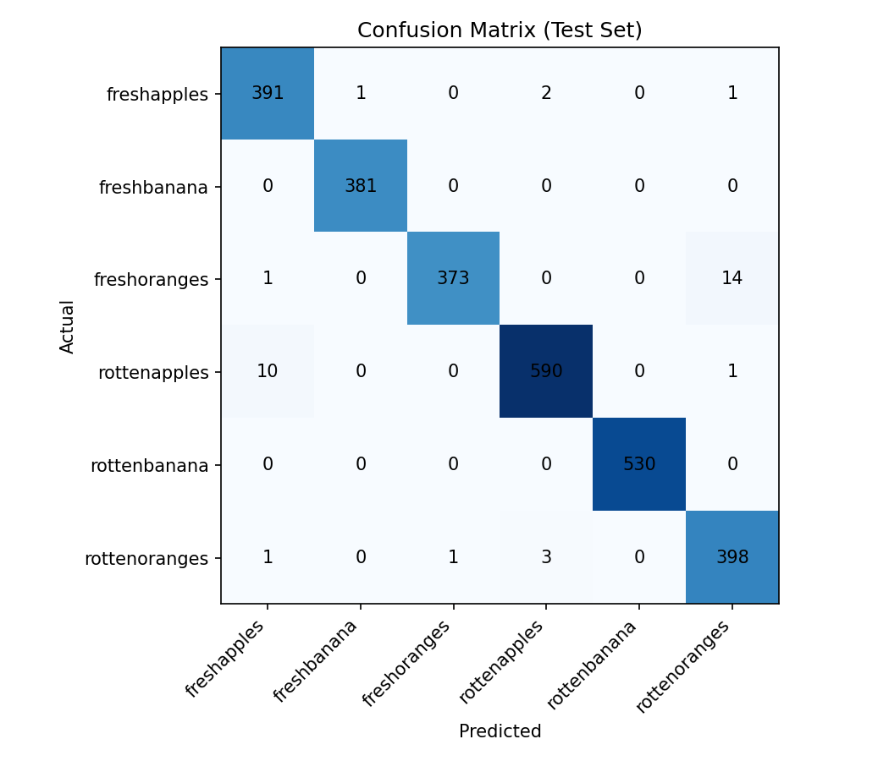

# 🍎 Food Freshness Detector

An AI-powered web app that checks whether an apple, banana or orange is **fresh or rotten** from a single photo. Built with transfer learning (MobileNetV2) and deployed as a Streamlit app.

> **Live demo:** [food-freshness-detector.streamlit.app](https://food-freshness-detector-lt3xzs7breynyphdlkpzo4.streamlit.app) (hosted on Streamlit Community Cloud; the app may need a few seconds to wake up if it has been idle)



## Problem

Food distributors and retailers inspect produce by eye, which is slow and inconsistent. This project explores whether a lightweight computer vision model can automate a first-pass freshness check from a phone or camera image.

## What it does

- Takes an uploaded fruit photo
- Predicts the fruit (apple, banana, orange) and its condition (fresh or rotten)
- Shows the confidence score
- Asks the user to retake the photo when confidence is below 70%

## Dataset

[Fruits fresh and rotten for classification](https://www.kaggle.com/datasets/sriramr/fruits-fresh-and-rotten-for-classification) (Kaggle, Sriram Reddy Kalluri).

| Split | Images | Notes |
|---|---|---|
| Train | 8,721 | 80% of the original train folder |
| Validation | 2,180 | 20% of the original train folder (`seed=42`) |
| Test | 2,698 | Original test folder, used only for final evaluation |

6 classes: `freshapples`, `freshbanana`, `freshoranges`, `rottenapples`, `rottenbanana`, `rottenoranges`.

## Approach

- **Model:** MobileNetV2 pretrained on ImageNet, base frozen, new classification head (GlobalAveragePooling, Dropout 0.3, Dense softmax)
- **Input:** 224 x 224 RGB
- **Augmentation:** random horizontal flip, rotation, zoom, brightness
- **Training:** Adam optimizer, sparse categorical cross-entropy, batch size 32, 8 epochs on a Colab T4 GPU
- **Stack:** Python 3.12, TensorFlow/Keras, scikit-learn, Streamlit

## Results

Evaluated on the held-out test set (2,698 images the model never saw during training or validation).

| Metric | Value |
|---|---|
| Test accuracy | **98.70%** |
| Validation accuracy | 98.99% |
| Training accuracy | 98.57% |

Per-class results on the test set:

| Class | Precision | Recall | F1 |
|---|---|---|---|
| freshapples | 0.97 | 0.99 | 0.98 |
| freshbanana | 1.00 | 1.00 | 1.00 |
| freshoranges | 1.00 | 0.96 | 0.98 |
| rottenapples | 0.99 | 0.98 | 0.99 |
| rottenbanana | 1.00 | 1.00 | 1.00 |
| rottenoranges | 0.96 | 0.99 | 0.97 |

Bananas are classified almost perfectly. Oranges are the weakest class: fresh and rotten oranges are occasionally confused with each other.

Validation and test accuracy are very close, and validation loss kept falling across epochs, so there is no sign of overfitting.

### Real-world test

_TODO: photograph 50-100 fruits with a phone (different lighting and backgrounds), run them through the app, and record the accuracy here._

## Limitations

- The training dataset has clean, well-lit photos, so accuracy on messy real-world photos is likely lower
- Only three fruits are supported
- The model always picks one of the six classes, so a non-fruit image will still get a prediction
- Fresh vs rotten is binary; there is no "slightly aged" grade

## Run locally

```bash
git clone https://github.com/Ishanii22/food-freshness-detector.git
cd food-freshness-detector

py -3.12 -m venv venv
venv\Scripts\activate          # Windows
pip install -r requirements.txt

streamlit run app/app.py
```

The trained model is expected at `models/freshness_model.keras`.

## Project structure

```
food-freshness-detector/
├── app/            # Streamlit app
├── assets/         # Images used in this README
├── data/           # Dataset (not tracked by git)
├── models/         # Trained model
├── notebooks/      # Training notebook
├── src/
├── requirements.txt
└── README.md
```

## Future work

- Grad-CAM heatmaps to show what the model looks at
- "Not a supported fruit" detection
- More fruits and vegetables
- Batch inspection dashboard for many photos at once
- Fine-tuning the top MobileNetV2 layers
- Deployment as an API (FastAPI) and a mobile-ready TensorFlow Lite model